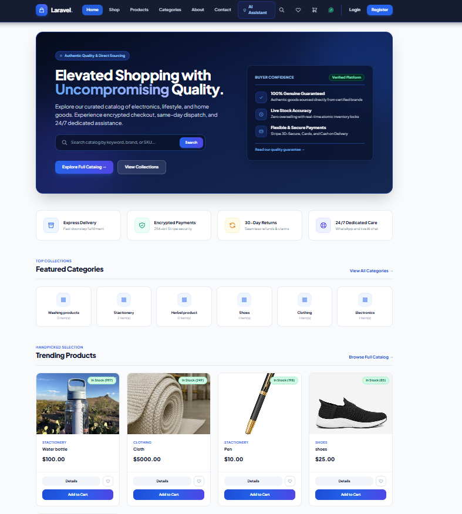
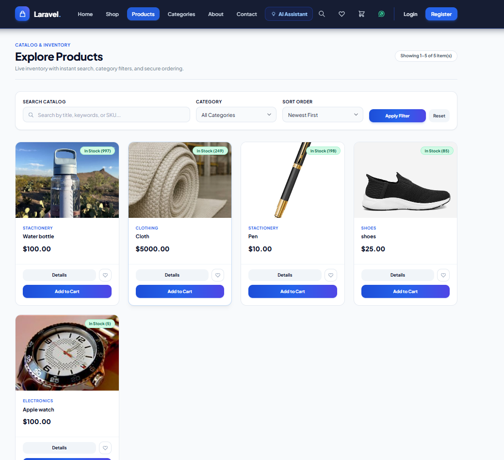
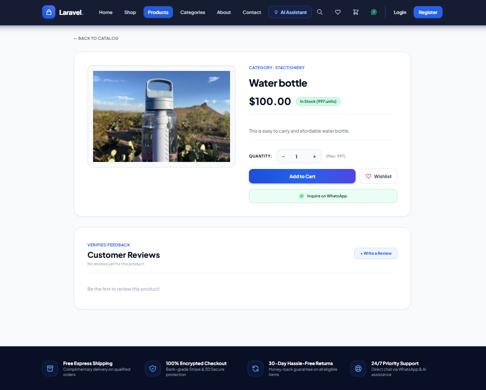
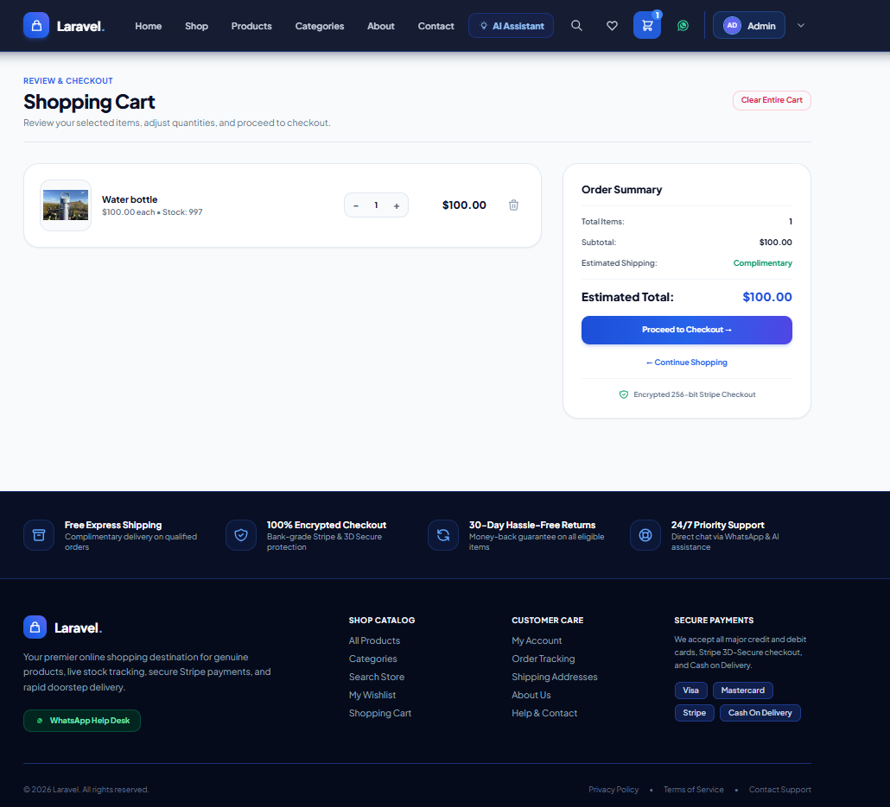

# 🛒 Ecommerce

A full-stack ecommerce web application built with Laravel.

## 📌 Project Overview

Ecommerce is a web-based online shopping platform developed using Laravel.

The application provides users with an easy and convenient way to browse products, view product details, manage their shopping cart, and place orders.

## 📸 Project Preview



## ✨ Features

- 👤 User Registration & Login
- 🛍️ Product Browsing
- 🔎 Product Search
- 📂 Product Categories
- 📦 Product Details
- 🛒 Shopping Cart
- ➕ Add Products to Cart
- ➖ Remove Products from Cart
- 📱 Responsive Design
- 🔐 User Authentication

## 🛠️ Technologies Used

- PHP
- Laravel
- MySQL
- HTML5
- CSS3
- JavaScript
- Bootstrap

## 📸 Screenshots

### 🏠 Home Page


### 🛍️ Products



### 📦 Product Details



### 🛒 Shopping Cart



## ⚙️ Installation

### 1. Clone the repository

```bash
git clone https://github.com/YOUR-USERNAME/YOUR-REPOSITORY.git